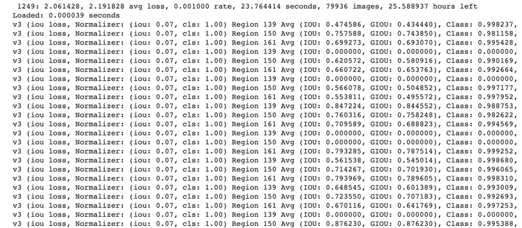

# YOLO-v4_Intrusion_Warning
1. Tổng Quan
- Đề tài “SỬ DỤNG THỊ GIÁC MÁY TÍNH ĐỂ PHÁT HIỆN ĐỐI TƯỢNG NGƯỜI ĐI BỘ TRONG NHÀ VÀ CẢNH BÁO XÂM NHẬP” phát triển một ứng dụng có phát hiện đối tượng NGƯỜI ĐI BỘ TRONG NHÀ VÀ CẢNH BÁO XÂM NHẬP, video sử dụng mô hình Yolov4 để phát hiện đối tượng. 
2. Thư Viên Sử Dụng
- opencv-python: cung cấp các công cụ và hàm để thực hiện các tác vụ liên quan đến xử lý ảnh như: đọc và ghi ảnh và video…
- numpy: cung cấp các hàm và công cụ để thực hiện các phép tính số học, đại số tuyến tính, xử lý ảnh và xử lý tín hiệu.
- PyQt5: cung cấp các thành phần giao diện người dùng (UI) như các nút bấm, các hộp thoại, các trình chỉnh sửa văn bản và các cửa sổ đồ họa để xây dựng các chương trình python ứng dụng phức tạp.
- shapely: cung cấp tính năng vẽ hình, các đối tượng hình học, như điểm, đường thẳng, đa giác, v.v..
- python-telegram-bot: cung cấp một API Python cho các tính năng của Telegram Bot API, cho phép người dùng tạo ra các bot Telegram với các tính năng tùy chỉnh khác.
- telegram: được sử dụng để tương tác với ứng dụng Telegram thông qua API của nó. Ngoài ra, cung cấp các lớp và phương thức cho phép người dùng tạo, cấu hình và điều khiển các bot Telegram.
- asyncio: sử dụng để viết các ứng dụng bất đồng bộ (asynchronous) trong Python.
- datetime: cung cấp các lớp và phương thức để làm việc với dữ liệu ngày tháng.
