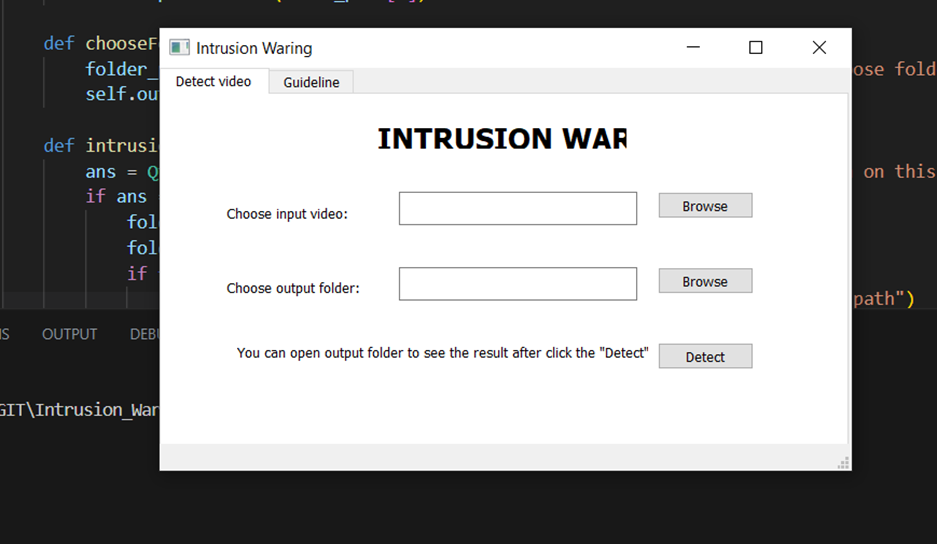
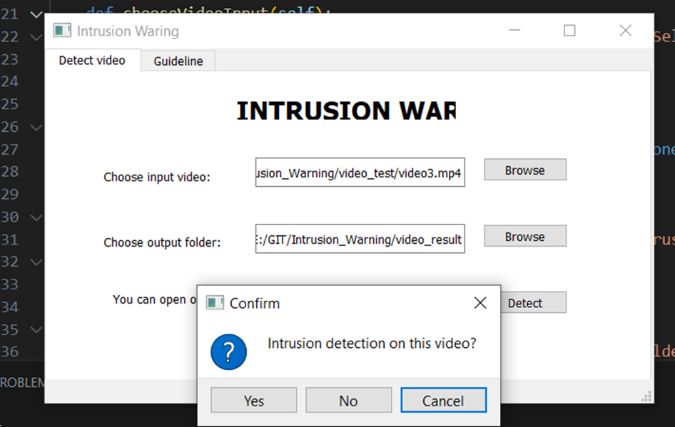
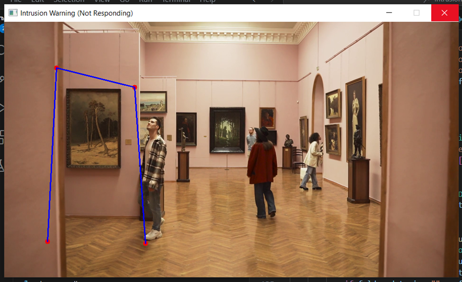
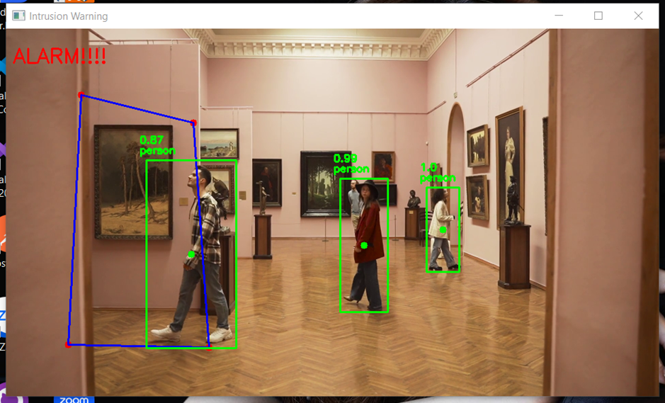
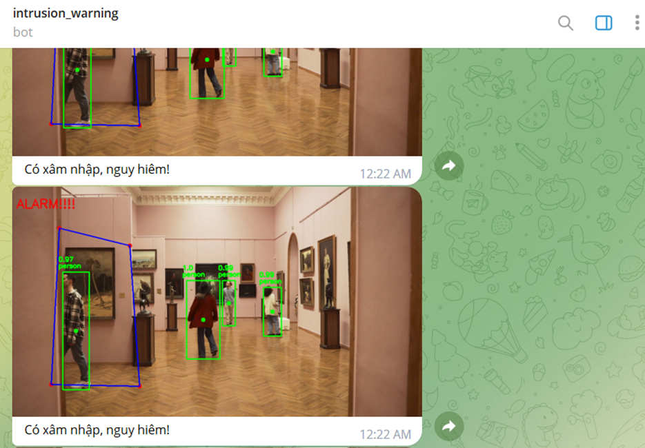

#BY: TRƯƠNG TẤN NGHĨA
#ID: 61131950
#CLASS: 61-CNTT_2
#SCHOOL: NHA TRANG UNIVERSITY
# YOLO-v4_Intrusion_Warning
## Tổng Quan
- Đề tài “SỬ DỤNG THỊ GIÁC MÁY TÍNH ĐỂ PHÁT HIỆN ĐỐI TƯỢNG NGƯỜI ĐI BỘ TRONG NHÀ VÀ CẢNH BÁO XÂM NHẬP” phát triển một ứng dụng có phát hiện đối tượng NGƯỜI ĐI BỘ TRONG NHÀ VÀ CẢNH BÁO XÂM NHẬP, video sử dụng mô hình Yolov4 để phát hiện đối tượng. 
## Thư Viên Sử Dụng
- opencv-python: cung cấp các công cụ và hàm để thực hiện các tác vụ liên quan đến xử lý ảnh như: đọc và ghi ảnh và video…
- numpy: cung cấp các hàm và công cụ để thực hiện các phép tính số học, đại số tuyến tính, xử lý ảnh và xử lý tín hiệu.
- PyQt5: cung cấp các thành phần giao diện người dùng (UI) như các nút bấm, các hộp thoại, các trình chỉnh sửa văn bản và các cửa sổ đồ họa để xây dựng các chương trình python ứng dụng phức tạp.
- shapely: cung cấp tính năng vẽ hình, các đối tượng hình học, như điểm, đường thẳng, đa giác, v.v..
- python-telegram-bot: cung cấp một API Python cho các tính năng của Telegram Bot API, cho phép người dùng tạo ra các bot Telegram với các tính năng tùy chỉnh khác.
- telegram: được sử dụng để tương tác với ứng dụng Telegram thông qua API của nó. Ngoài ra, cung cấp các lớp và phương thức cho phép người dùng tạo, cấu hình và điều khiển các bot Telegram.
- asyncio: sử dụng để viết các ứng dụng bất đồng bộ (asynchronous) trong Python.
- datetime: cung cấp các lớp và phương thức để làm việc với dữ liệu ngày tháng.
## Kết Quả
1. Giao diện của ứng dung có 2 tab
Tab 1: Phát hiện đối tượng cần NGƯỜI ĐI BỘ TRONG NHÀ VÀ CẢNH BÁO XÂM NHẬP  
•	Input 1: chọn video cần phát hiện đối tượng.
•	Input 2: chọn thư mục lưu video kết quả sau khi phát hiện.
•	Nút chọn video, nút chọn thư mục và nút để bắt đầu phát hiện.

Sau khi ấn “detect” hiện ra hộp thoại xác nhận bắt đầu. 

2. Phát hiện và đưa ra cảnh báo trên màn hình
Video hiện ra, vẽ các điểm để tạo ra 1 hình tứ giác trên khung hình và hình tứ giác đó được xem như là vùng cảnh báo khi có người đi vào.

Khi đối tượng đi vào vùng cảnh báo đó thì trên màn hình sẽ hiển thị cảnh báo “ALARM” ngay trên khung hình. 

3. Gửi tin nhắn thông báo có người xâm nhập qua Telegram
Khi có đối tượng đi vào vùng cảnh báo được vẽ trước đó ứng dụng sẽ chụp hình lại đối tượng xâm nhập vào vùng cảnh báo và gửi một tin nhắn cảnh báo kèm hình ảnh đã chụp tới telegram của người dùng thông qua ID của tài khoản telegram và token của tobot-chat được tạo trên telegram của tài khoản đó sau mỗi 15s một lần gửi:

Ứng dụng chỉ đưa ra cảnh báo “ALARM” và chụp hình đối tượng xâm nhập gửi thông báo “Có xâm nhập, nguy hiểm” qua telegram chỉ khi đối tượng đối tượng nào đó xâm nhập vào vùng cảnh báo. Còn nếu đối tượng không xâm nhập vào vùng cảnh báo thì ứng dụng sẽ không đưa ra cảnh báo “ALARM” và cũng sẽ không gửi thông báo “Có xâm nhập, nguy hiểm” qua telegram.
